# Parte 1 - Preparación de Entornos de Desarrollo

## 1.1 Entorno 1 — JupyterLab + Almond Kernel + Scala 2.12.21

### Instalación y comprobación de herramientas base
Instale `coursier`  y comprobé que estaba disponible . A continuación, instale Scala, sbt y Almond mediante coursier.

### Ejecución de JupyterLab con Almond
Tras instalar JupyterLab utilizando Python, inicié el servidor. Como se puede observar en la siguiente captura y el kernel de Scala (Almond) está disponible para su uso desde el Launcher principal.

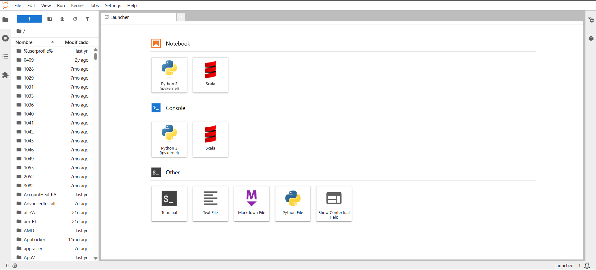

### Uso del Notebook y verificación de la versión de Scala
Creé un nuevo Notebook seleccionando el kernel de Scala. Para verificar que el entorno utilizaba la versión requerida ejecuté el comando de comprobación de versión, obteniendo como resultado la versión 2.12.21.

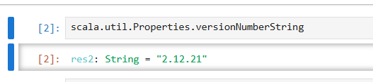

### Ejecución de pruebas en el Notebook
Redacte y ejecuté tres celdas de prueba que incluían declaración de variables, operaciones numéricas y listas.

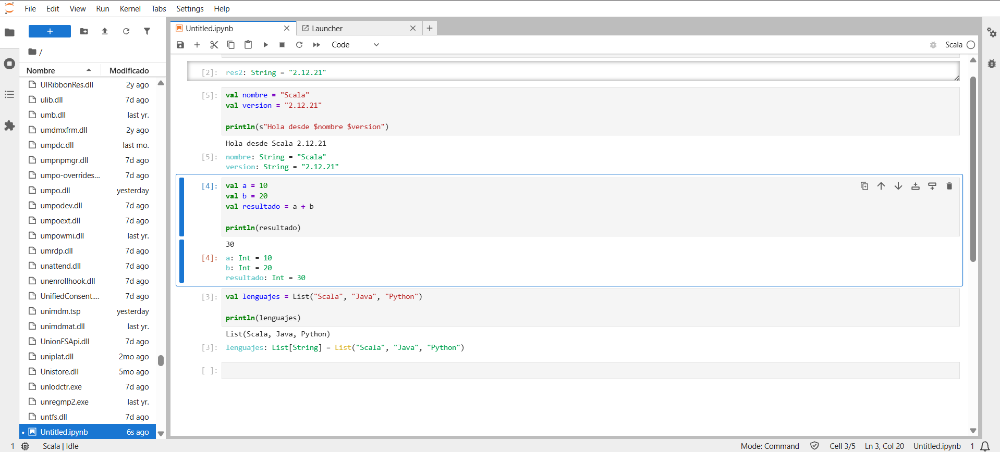

---

## 1.2 Entorno 2 — Visual Studio Code + Metals + sbt

### Instalación de Java y sbt
Para este entorno, primero verifiqué la instalación de JDK 17  y la herramienta de construcción `sbt`. Reciviendo las siguientes respuestas.

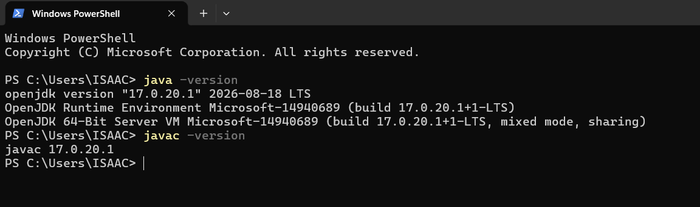
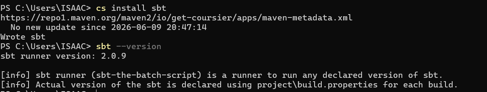

### Configuración de Visual Studio Code y Metals
Al tener ya isnstalado visual studio code busqué busque en la store la extensión oficial Scala (Metals), realice instalación para habilitar las funcionalidades de IDE.

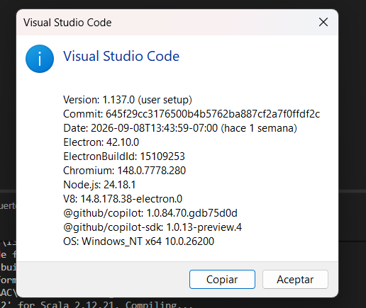
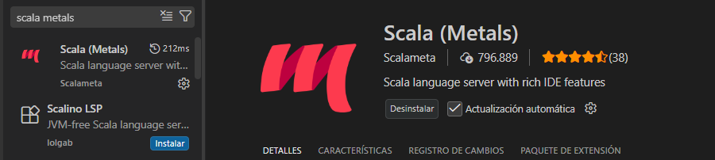

### Estructura del proyecto y configuración
Creé el directorio `scala-vscode` estructurado con las carpetas `project` y `src/main/scala`. En la raíz del proyecto configuré el archivo `build.sbt` para requerir Scala 2.12.21 y añadí el código del programa en `Main.scala`

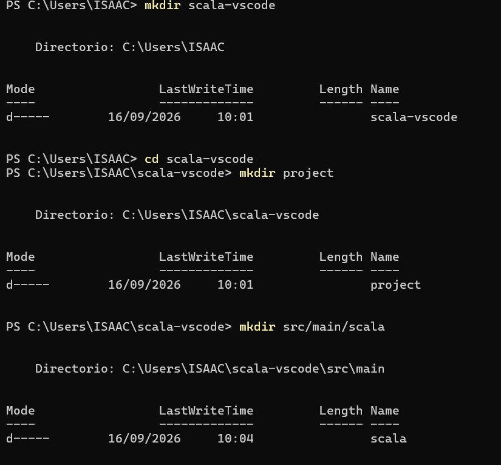
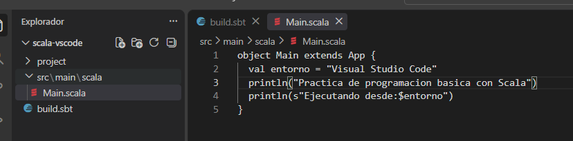

### Importación en Metals
Al abrir el proyecto, Metals detectó el archivo `build.sbt` y solicitó importar la configuración del "build", reconociendo así el proyecto Scala.

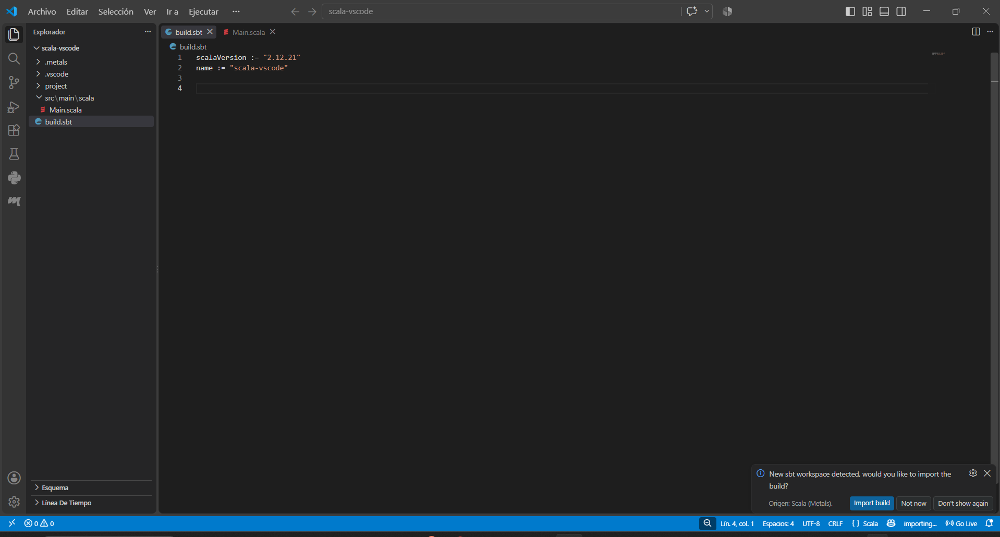

### Compilación y ejecución mediante sbt
Mediante la terminal integrada del editor y ejecuté `sbt compile`, finalizando con éxito. Posteriormente ejecuté `sbt run`, obteniendo la salida esperada.

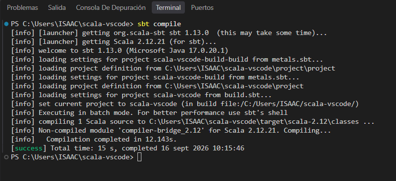
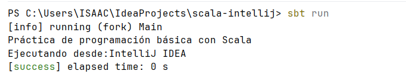

---

## 1.3 Entorno 3 — IntelliJ IDEA Community + sbt

### Verificacion existencia del IDE y el plugin de Scala
Como va tenia instalao el IDE, entre directamente en la seccion de plugins y descargué el soporte para el lenguaje Scala.

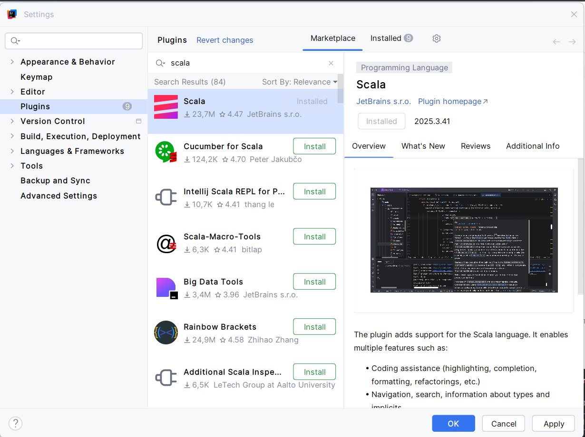

### Creación del proyecto y configuración de JDK
Creé un nuevo proyecto basado en sbt con el nombre `scala-intellij`. Durante la configuración, seleccioné el JDK 17 y la version `2.12.21`de scala

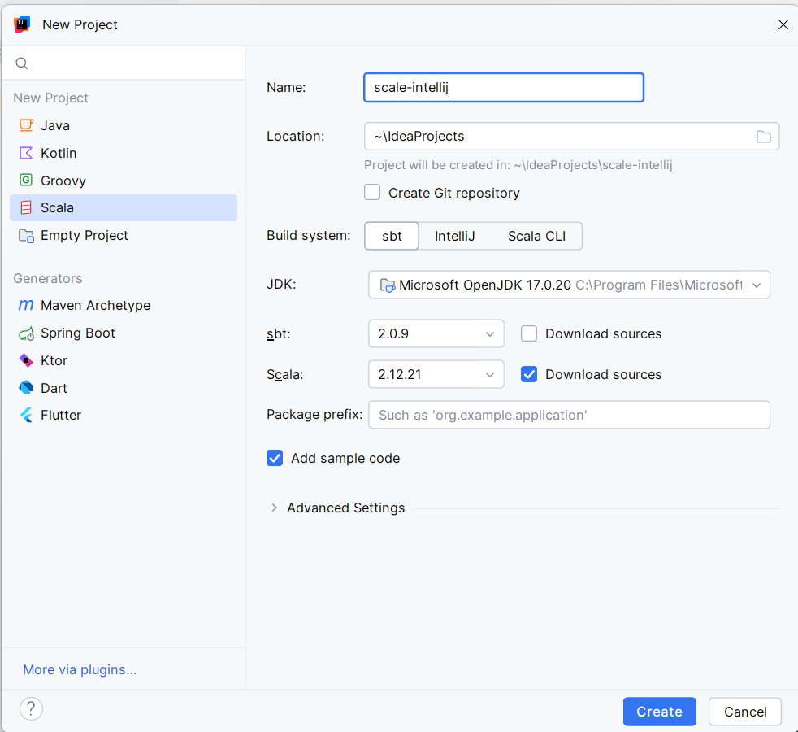

### Archivos del proyecto
El IDE generó automáticamente la estructura junto con el archivo`main.scala` . Revisé que el archivo `build.sbt` contuviera la versión `2.12.21` y escribí el código de prueba en `Main.scala`.

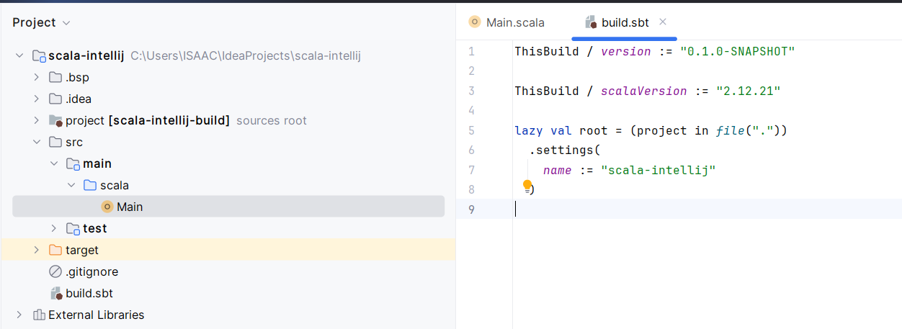

### Ejecución desde el entorno gráfico
Utilicé el botón "Run" integrado en el editor para ejecutar `Main.scala`. La consola inferior mostró el mensaje indicando que se estaba ejecutando desde IntelliJ IDEA.

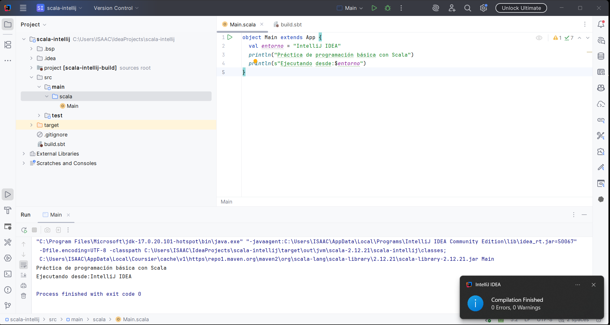

### Ejecición desde la terminal de comandos
Abri una terminal integrada del editor y ejecuté `sbt compile`, tras su finalizacion ejecuté `sbt run`, obteniendo la misma salida que el en entrono gráfico.

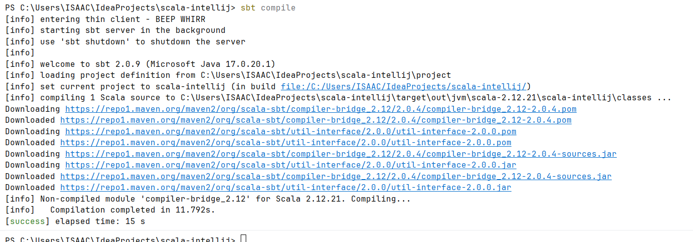

